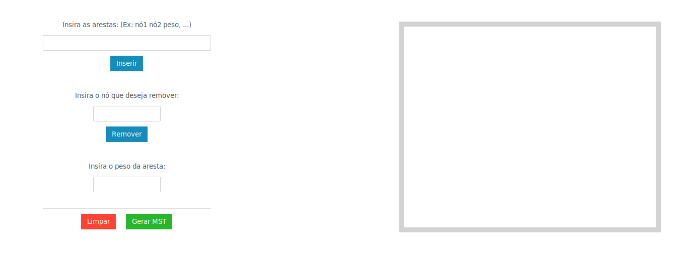
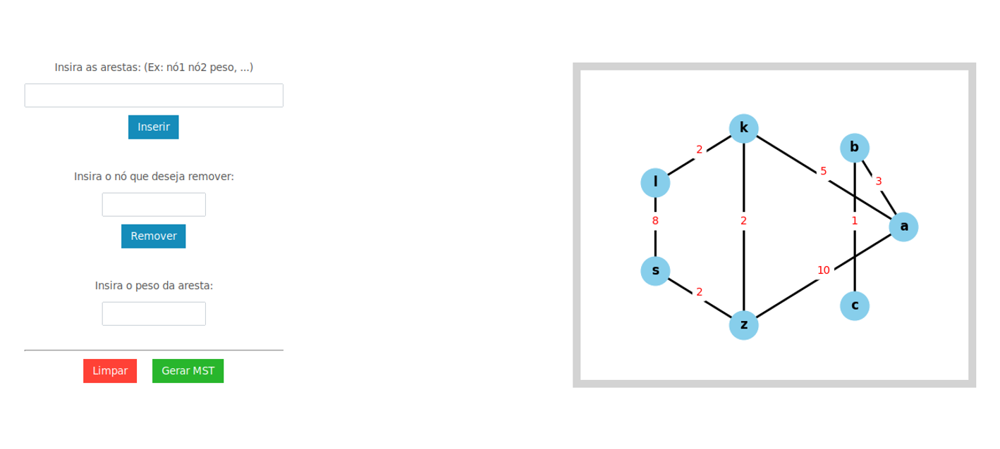
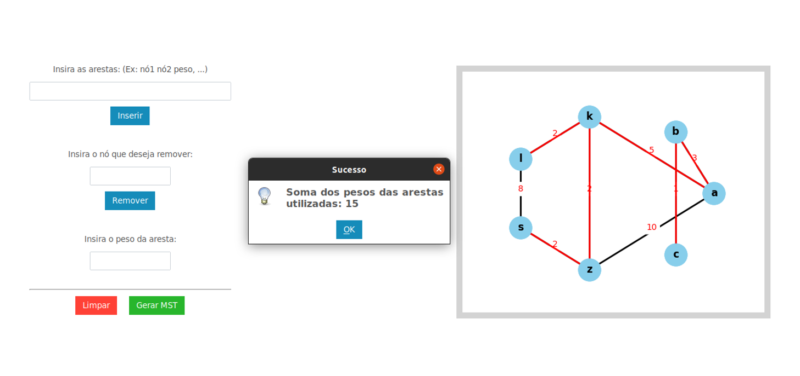

# MST Visualizer

[Vídeo de apresentação]()

**Número da Lista**: 1 
**Conteúdo da Disciplina**: Grafos 2 

## Alunos

| Matrícula  | Aluno                        |
| ---------- | ---------------------------- |
| 19/0036567 | Pedro Lucas Cassiano Martins |
| 19/0020814 | Vinícius Roriz               |

## Sobre

O projeto MST Visualizer é o segundo trabalho da dupla para a disciplina de Projeto de Algoritmos e remete ao segundo conteúdo dos métodos de travessia de grafos abrangendo Djikistra, Prim e Kruskal.
O objetivo do projeto é criar uma janela interativa onde o usuário pode criar e visualizar grafos, além de gerar a MST desse grafo utilizando o algoritmo de Prim. O aplicativo cria um grafo baseado nas conexões e pesos descritas por texto pelo usuário, e também permite que o usuário crie os nós e os conecte com o clique do mouse, e por fim gera a MST do grafo desenhado na tela.

## Screenshots

## Instalação

**Linguagem**: Python 

##### Crie um ambiente virtual:

`$ python3 -m venv venv `

##### Entre no ambiente virtual

`$ ./venv/bin/activate`
ou
` .\venv\Script\activate`

##### Instale os requirements

`$ pip install -r requirements.txt`

##### Execute a main.py

`$ python3 src/main.py`

## Uso

1. Digite as arestas do grafo desejado na seguinte maneira: `A B 2, A C 3, B C 2, C D 5, B D 3, B E 5, C E 2, E F 1, D F 2`
2. Após gerado, é possível clicar em espaços em branco na figura para gerar novos nós, e em 2 nós para gerar uma aresta. O peso da aresta é definido no campo de texto "Insira o peso da aresta", e caso vazio, insere com o peso igual a 1.
3. É possível também remover um nó digitando o rótulo dele na caixa de texto "Insira o nó que deseja remover" e clicando no botão.
4. Por fim temos os botões Limpar, que apaga o grafo, e gerar MST, que mostra a árvore geradora mínima.
